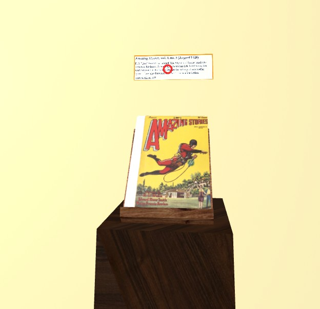
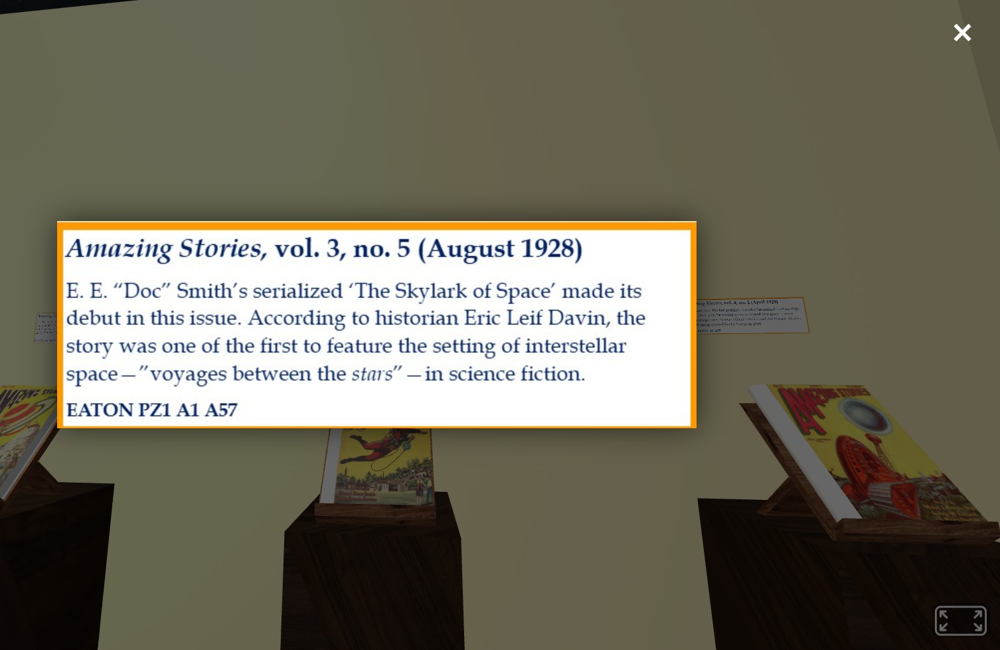

# Library Showcase

A virtual 3D space, built with A-Frame and hosted on GitHub Pages, where visitors can browse and view Amazing Stories volumes.

**Live site:** https://marvrodri413.github.io/library-showcase-hosting-/

## Instructions

To zoom in and see the text on the descriptions over the book podiums, hover the red circle cursor over the description and click. The text will pop up, and you can exit using the X in the top right corner.

**Hover over the description:**

**Click to zoom in:**

## Framework

- **[A-Frame](https://aframe.io/)** v1.5.0 — WebVR/3D scene framework used to build the gallery.
  - Source: https://github.com/aframevr/aframe
  - Docs: https://aframe.io/docs/1.5.0/introduction/
  - License: MIT

## Content Sources

- **Amazing Stories Volumes** — cover imagery referenced from:
  http://www.philsp.com/data/images/a/amazing_stories_196010.jpg

## 3D Model Sources

- **Book Model** — sourced from The Base Mesh model library:
  https://www.thebasemesh.com/model-library

## Tools Used

- **TinkerCAD** — 3D modeling / prototyping
- **Blender** — 3D modeling and asset preparation
- **Visual Studio Code** — code editor for building the scene and scripts

## Analytics

- **[GoatCounter](https://www.goatcounter.com/)** — open source, privacy-friendly web analytics used to track site visits.
  - Dashboard: https://ucrlibraryshowcase.goatcounter.com
  - License: EUPL (source available, self-hostable)

## Hosting

- **GitHub Pages** — static hosting for the virtual showcase